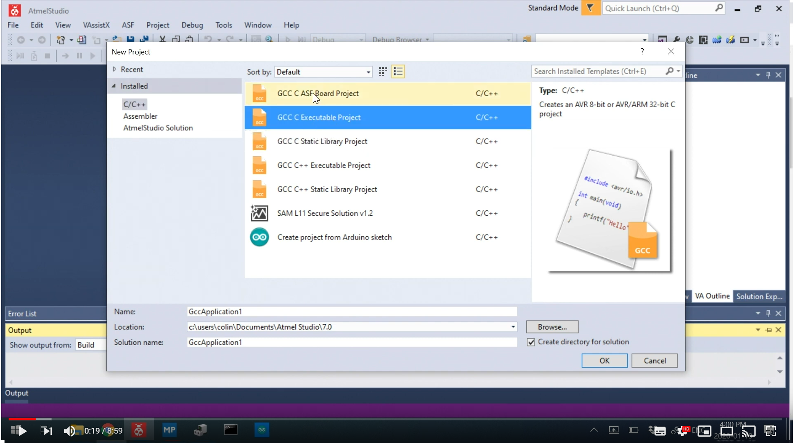

# Environment Setup

This repository uses Atmel Studio to complete many tasks. The Atmel Studio environment is slightly different than Arduino, but shares many similarities.

## Changing Atmel Studio for New COM Port

If you have previosuly followed these instructions, OR are using a Dalhousie lab computer with the work configured, you should follow these instructions:

1. Adjust COM port, see [Detailed Instructions](changing-com-port.md).
2. Build the Demo Program (see below).

## Atmel Studio Setup (on your own computer).

If you are working on your own computer, you can install Atmel Studio and set it up to work with the Nano. Follow these directions:

1. Install [Atmel Studio](https://www.microchip.com/mplab/avr-support/atmel-studio-7).
2. Setup the [External Nano Downloader](setup-nano-downloader-ver1.md) (video on that page)
3. Build the Demo Program (see below).

## Demo Program

The next step is to build a demo program. This is shown in the following video:

[](https://www.youtube.com/watch?v=OFWEtJ-_--M)

[ENGI 2203-02: Arduino Nano Atmel Studio Setup (Part 2)](https://www.youtube.com/watch?v=OFWEtJ-_--M)

The configuration steps are:

1. Make a new project, with type as "GCC C Executable Project"
2. Select the "ATMEGA328P" as the device.
3. Copy the code below into the project ```main.c``` file.
4. Build the program.
5. Run the Nano Downloader tool you defined.
6. Check the LED is blinking.
 
Code to download:

	#define F_CPU 16000000UL
	#include <avr/io.h>
	#include <util/delay.h>
	
	int main(void)
	{
		DDRB |= (1 << DDB5);
	    /* Replace with your application code */
	    while (1) 
	    {
			PORTB ^= (1<<PORTB5);
			_delay_ms(100);		
	    }
	}
