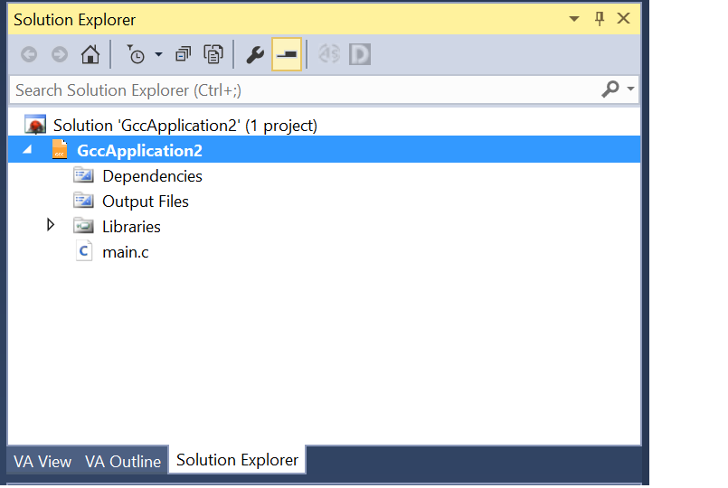
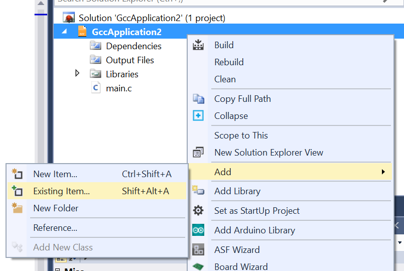

# Multiple Files with Atmel Studio

It can be useful to have multiple files in our project. This requires a little bit more effort.

Once we have a virgin project with our empty main (see [Introduction for how to do that if you forget](README.md)), we just need to add a file to it.

1. To do this, ensure the Solution Explorer is visible and click on the **project**:

2. Right-click on this, and select "Add existing file" (if existing) or new (if you want a blank file).

3. Navigate to where you downloaded the C file to add (if relevant) and add to the project. 

