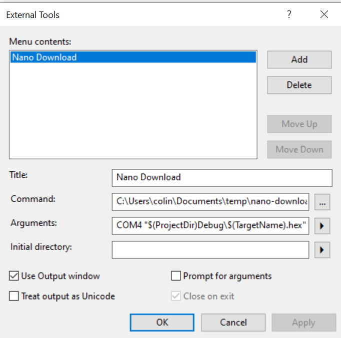

# Setting up Atmel Studio with AVRDude Bootloader

You can see the following video which goes through all the configuration of these three acts:

## Act 1: Installing Atmel STudio

1. Install Atmel Studio.
2. Be sure to enable the "8-bit microcontroller" features. You don't need the 32-bit or ARM features for this class.

## Act 2: What's my COM Port?

1. Open the Windows Device Manager, by typing ```devmgmt.msc``` into your start menu search or run bar.
2. Scroll down to "XXXX"
3. Look at existing COM ports - you may not have any (as in my video).
4. Plug in your Nano device. You may need to install drivers for it to work - if you don't get the COM port, try installing the Arduino software.
5. Once the device is working, note the COM port number:

In this example my device is COM4.

**NOTE**: When you plug into different USB ports on your computer, you will get a new COM port number. It is easiest to always plug into the same USB port where possible.

## Act 3: External Tools

1. Download the file [avrdude-batch.zip](https://github.com/colinoflynn/microcontroller-intro-with-arduinonano/raw/master/1-Environment-Setup/avrdude-batch.zip) and extract somewhere you can use (such as in a Documents folder).
2. Open Atmel Studio.
3. Select "Tools -> External Tools" (if you don't have this see below to fix, then return here).
4. Somewhere you extracted the zipfile.Press the ```...``` button beside ```commmand```, and point it to the file ```nano-download.bat``` that you extracted.
5. Set the ```Arguments``` to ```COM4 "$(ProjectDir)Debug\$(TargetName).hex"```. Note you will **need to change COM4 to be YOUR com port you found in ACT1**!!!.
6. Click the "Use Output Window" check-box.
7. For reference, it should look something like this:

8. Close the window, and run the tool from the "Tools" menu. You should see output like the following (NOTE - you will get some errors as we don't have a project yet).


If you don't get the console output, see troubleshooting below.

### Troubleshooting - No External Tools Option

1. Under "Tools" select the "Profile" option. Switch to the "Advanced" profile.

### Troubleshooting - No Output Window

When running the tool you may see no output window. This commonly happens for two reasons:
1. You forgot to check the "Use Output Window" check-box.
2. Windows is blocking the executable.

If you have checked the box, the problem is likely the second one. To check this:

1. Open a CMD window (type ```cmd``` at start menu of windows, press enter).
2. Copy the ```command``` line from Atmel Studio, and try to run that. If you get an error about Windows blocking the file, you'll need to fix that first.