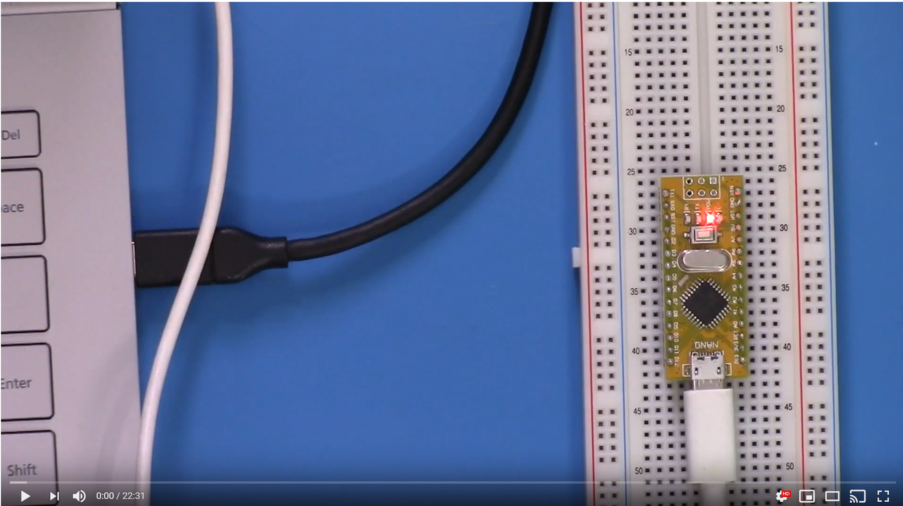
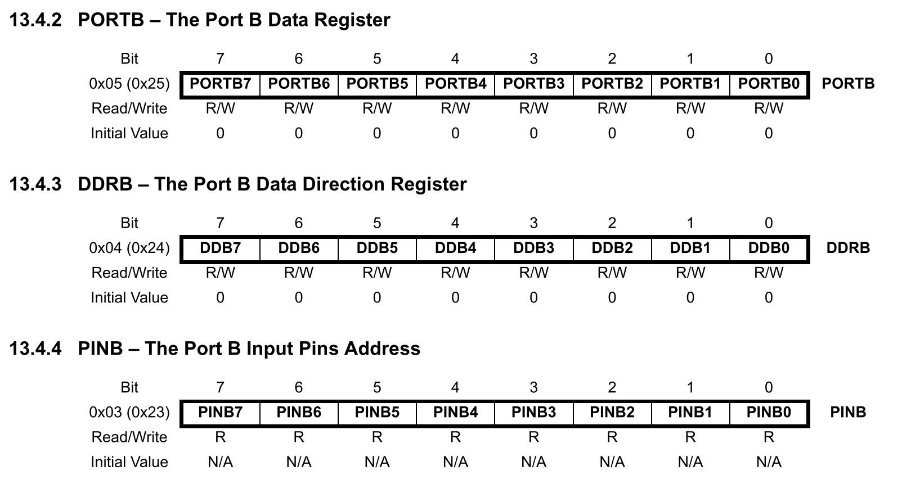
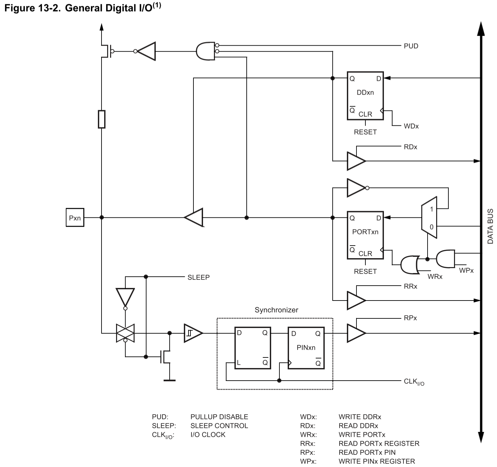

#Introduction to GPIO

The following video goes through the relevant material on the GPIO pin:

[ENGI 2203-02: Introduction to GPIO with ATMega328P](https://youtu.be/WKQMCwCtVrs)

## Gpio Reference

most of the time, we will be using the GPIO registers given below:

The registers are connected as given below:

## Example Code

The simple code to read a single pin register and forward to the LED is given below:

	#define F_CPU 16000000UL
	#include <avr/io.h>
	#include <util/delay.h>
	
	int main(void)
	{
		DDRB |= (1 << DDB5); //00100000
		
	    /* Replace with your application code */
	    while (1) 
	    {
			if (PINC & (1<<PINC0)) {
				PORTB |= (1<<PORTB5);
				} else {
				PORTB &= ~(1<<PORTB5);
			}	
	    }
	}
	
