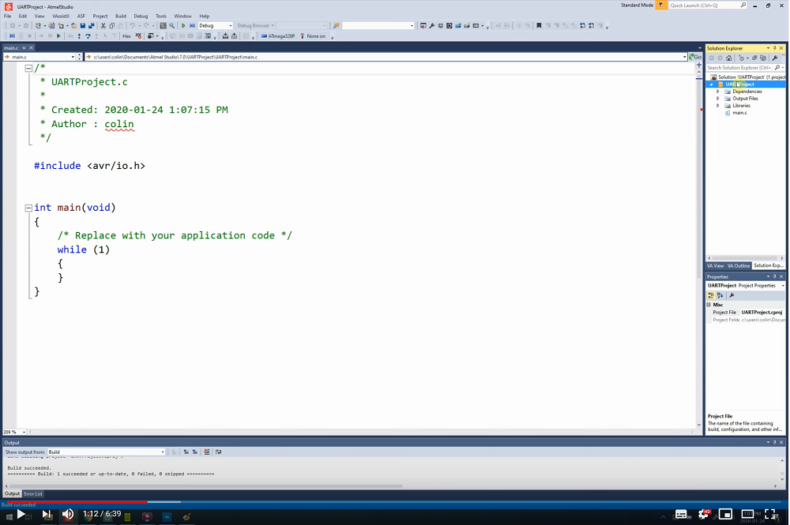

# UART Example

This simple example will help you enable printf & scanf on your Arduino.

1. Download the file ```uart_utility_function.c```
2. Add to an Atmel Studio project (see [atmelstudio-multifile.md](https://github.com/colinoflynn/microcontroller-intro-with-arduinonano/blob/master/1-Environment-Setup/atmelstudio-multifile.md) for detailed directions).
3. Implement the code shown below to finish the project.

This is shown in detail in this video:

[](https://youtu.be/8H5kkrIjTnM)

## ⚠ Serial Port Conflict

⚠ Watch out - the serial port is used for downloading code to the Arduino along with debug. You'll need to disable your terminal emulator when you download new code to the device!

## Setting up Serial Terminal

A common serial terminal program to use is Putty on Windows, which you can download at [https://www.chiark.greenend.org.uk/~sgtatham/putty/latest.html](https://www.chiark.greenend.org.uk/~sgtatham/putty/latest.html).

Other "terminal emulators" can be used however, for example TeraTerm is popular (see the [https://learn.sparkfun.com/tutorials/terminal-basics/tera-term-windows](Spark Fun tutorial)).

### Putty Configuration

When you open Putty, configure:

* Connection Type = Serial
* Serial line = COM3 (on my computer, set as required on your device)
* Speed = 9600
 
Under the Connection -> Serial setup, change the following settings:
* Flow Control: None
 
Under Terminal, change the following settings:
* Implicit CR in every LF: Checked
* Local Echo: "Force On"

Before opening Putty, be sure to SAVE those settings. In the future you just double-click on the settings name to configure that and open the port, a huge time saving!

see the video for more details.

## Main Code

The following shows the example code you can run to see ```printf``` & ```scanf``` running.

	#include <avr/io.h>
	#define F_CPU 16000000UL
	#include <util/delay.h>


	int main(void){
		init_uart(); // initialization
		printf("System Booted, built %s on %s\n", __TIME__, __DATE__);
		printf("Hello There. What is your name?\n");
		char name[32];
		scanf("%s", name); // wait for your name (from host)
		printf("Alright %s. What is a number?\n", name); // returns it.
		int number;
		if (scanf("%d", &number) == 1){ // waits for an integer
			printf("OK %s, did you pick %d?\n", name, number); // return the info
		}
		else {
			printf("Hi %s - This is not an integer. Try again.\n", name);
		}
		
		while(1){
			printf("PIND Status: %02x\n", PIND);
			_delay_ms(1000);
		}
	}