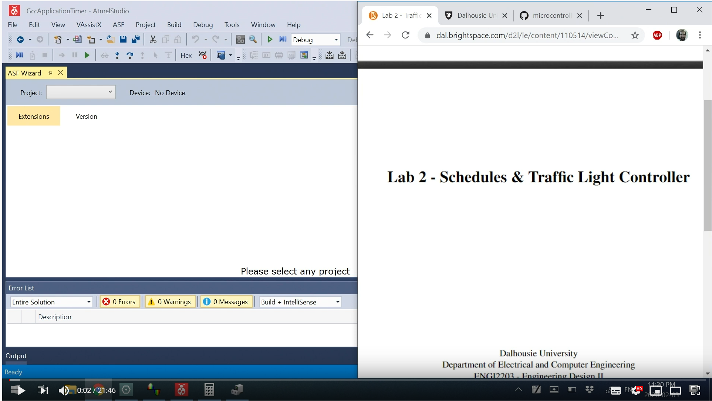
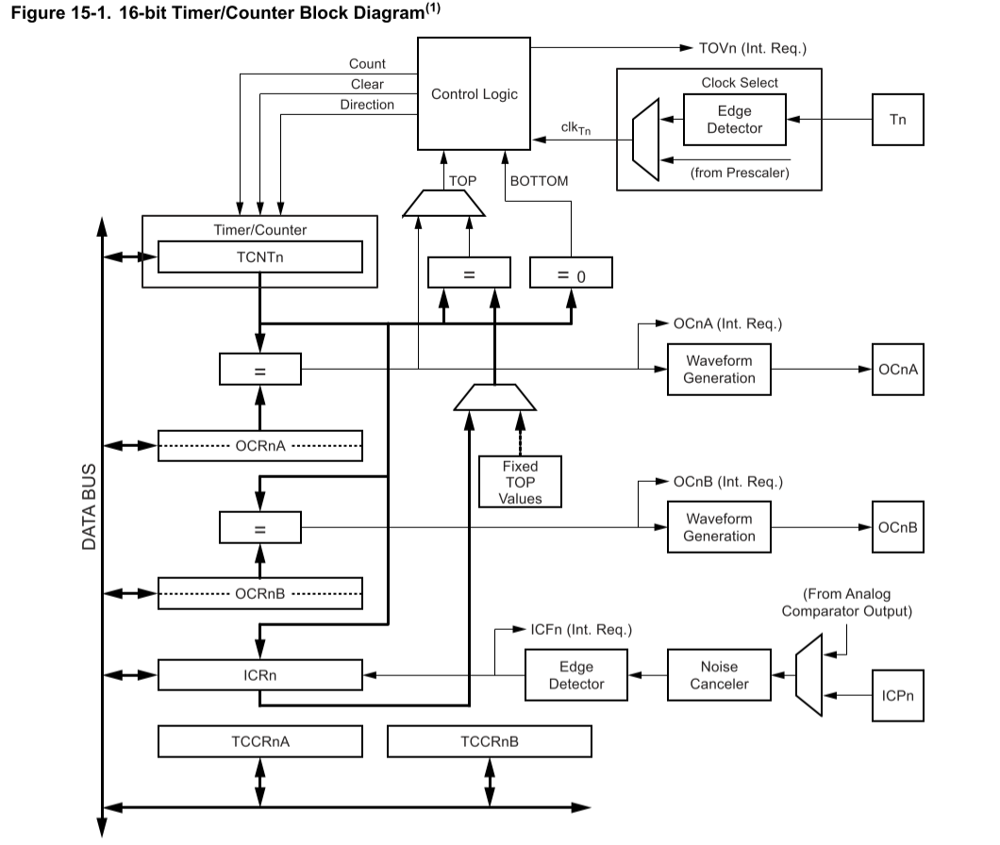

# Using Microcontroller Timers

In this lab, we'll be using the microcontroller timer to give us a ***tick value***.

The tick value is typically a global variable that counts how much time has passed.

Here's a short overview, this doesn't cover everything you can do:

[](https://youtu.be/n3FXhgVF3GU)

## About the Timer

The AtMEga328P has a timer/counter module. The contents of this module are as shown here:



See the datasheet for more information.

## About the Interrupts

# Simple Program Flow Example

With our new global variable, we could do the following:

    /* Replace with your application code */
    while (1) 
    {
		//Wait until 500 mS has passed
		while(Cnt != 500);
		
		PORTB ^= (1<<PORTB5);
		
		Cnt = 0;
    }

## Atomic Operations

There is a big problem that can happen when running the above code. We could interrupt *part-way* through an operation, this is very not good.

The best solution is to disable & re-enable interrupts every time. This means adding ```cli()``` and ```sei()``` around each access to a global variable:

	cli();
	if (Cnt == 500){
		//Do something
		}
	sei();

This gets confusing as you could easily forget a ```sei()```. Even worse, what happens if (as the above) the ```//Do something``` code blocks, and we never re-enable an interrupt? Very bad things!!

Instead, you could make some nice API like this:

	//Atomic count access
	unsigned int get_count(void){
		unsigned int cnt_copy;
		cli();
		cnt_copy = Cnt;
		sei();
		return cnt_copy;
	}


	//Atomic count access
	void set_count(unsigned int cnt){
		cli();
		Cnt = cnt;
		sei();
		return
	}

These two functions ***enforce** the atomic operation. Our main loop looks pretty easy now like this:


    /* Replace with your application code */
    while (1) 
    {
		//Wait until 500 mS has passed
		while(get_count() != 500);
		
		PORTB ^= (1<<PORTB5);
		
		set_count(0);
    }

## More Complex Program Flow

You could continue the program flow, and do some complex state operations:

	while(1)
	{
	
		//Do something at 0.5S
		while(get_count() != 500);
	
	
		//Do something at 2S
		while(get_count() != 2000);
	
		//Do something at 5.5S
		while(get_count() != 5500);
	
		set_count(0);
	}

# Using Compare Interrupt

What's the problem with our method? While our software is enforcing the value reset. A better way to do is is to use the Output Compare (OC) mode. This requires a different interrupt to be used.